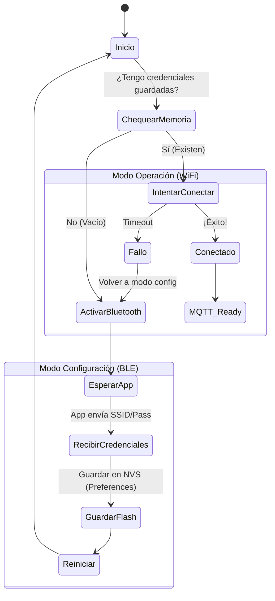

```mermaid
stateDiagram-v2
    [*] --> Inicio
    Inicio --> ChequearMemoria: ¿Tengo credenciales guardadas?
    
    state "Modo Configuración (BLE)" as BLE_MODE {
        ActivarBluetooth --> EsperarApp
        EsperarApp --> RecibirCredenciales: App envía SSID/Pass
        RecibirCredenciales --> GuardarFlash: Guardar en NVS (Preferences)
        GuardarFlash --> Reiniciar
    }

    state "Modo Operación (WiFi)" as WIFI_MODE {
        IntentarConectar --> Conectado: ¡Éxito!
        Conectado --> MQTT_Ready
        IntentarConectar --> Fallo: Timeout
        Fallo --> ActivarBluetooth: Volver a modo config
    }

    ChequearMemoria --> ActivarBluetooth: No (Vacío)
    ChequearMemoria --> IntentarConectar: Sí (Existen)
    
    Reiniciar --> Inicio
```