# Texel Smart-Device IoT Platform

## Resumen rápido
Sistema IoMT para equipos basados en ESP32 / Raspberry Pi + App Flutter. Soporta onboarding por BLE, telemetría por MQTT y control remoto.

## Arquitectura (alto nivel)
- Dispositivos (ESP32 / RPi) — Firmware en /firmware (PlatformIO).
- Broker MQTT — Contenedores en /backend-local (docker-compose.yml).
- Aplicación móvil — Flutter en /mobile-app (UI, BLE, MQTT).

Diagrama de datos: Equipo (BLE provision) -> WiFi -> Broker MQTT -> App móvil

## Estructura del repositorio (referencias directas)
- /mobile-app
  - Entrada: mobile-app/lib/main.dart
  - Dependencias: mobile-app/pubspec.yaml
  - Código: mobile-app/lib/core/ (servicios), mobile-app/lib/ui/ o components/ (pantallas, widgets)
- /backend-local
  - docker-compose.yml (Mosquitto broker, persistencia)
- /firmware
  - platformio.ini
  - src/ (código de device, WiFi/MQTT/BLE)
  - lib/ (helpers: WifiManager, MqttHandler)

## Requisitos previos
- Flutter SDK (compatible con Dart >= 3.10)
- PlatformIO (para firmware)
- Docker & docker-compose (para backend local)
- SDKs de plataforma si quieres compilar nativo (Windows/Android/iOS)

## Inicio rápido (comandos)
1) Backend (local)
- cd backend-local
- docker-compose up -d

2) Firmware (flash)
- Abrir /firmware en VS Code + PlatformIO
- Ajustar src/config.h (IP del broker) si aplica
- Conectar ESP32 y Upload desde PlatformIO

3) App móvil
- cd mobile-app
- flutter pub get
- flutter run -d windows   (o -d <device-id> / emulador)

Verifica: mobile-app/lib/main.dart y mobile-app/pubspec.yaml

## MQTT / Tópicos & ejemplos
- Telemetría: texel/v1/devices/{device_id}/telemetry
  - Ejemplo payload: {"temp":35.5,"status":"active"}
- Comandos: texel/v1/devices/{device_id}/command
  - Ejemplo payload: {"action":"reboot"}

## Desarrollo y pruebas
- Analizar: cd mobile-app && flutter analyze
- Tests: cd mobile-app && flutter test
- Linter: se usa flutter_lints; mantén null-safety

## Convenciones de código del proyecto
- UI: componentes pequeños y preferiblemente stateless en mobile-app/lib/ui o mobile-app/lib/components
- Lógica compartida y servicios en mobile-app/lib/core
- No editar archivos generados en carpetas */Flutter/ ni los GeneratedPluginRegistrant.*
- Cambios nativos: modificar runner/ o ios/Runner/ solo cuando sea estrictamente necesario; documentar en PR

## Integraciones y puntos críticos
- BLE: revisa implementaciones en mobile-app/lib/core/ble* (o mobile-app/lib/core/services)
- MQTT: mobile-app/lib/core/mqtt* y broker en backend-local/docker-compose.yml
- Si añades plugin nativo: actualizar pubspec.yaml y modificar runner/ o Runner/ según plataforma

## PR / colaboración
- Documenta cambios nativos y pasos para reproducirlos en la descripción del PR
- Consultar a mantenedores antes de introducir nuevos servicios backend o firmas de firmware

## Contacto
- Mantainers: (añadir emails/nombres del equipo aquí)

## Diagrama de conexión e infraestructura (Mermaid)

- Infraestructura (graph TD)
  - USER_ZONE: App móvil (MobileApp) y PC de desarrollo (DevPC).
  - EDGE_ZONE: Equipos de campo (ESP32, RPi) que hacen provisioning por BLE y luego operan por WiFi.
  - SERVER_ZONE: Host Docker que ejecuta Mosquitto (broker MQTT) y herramientas de observabilidad (MQTTExplorer).
  - Conexiones clave: BLE para provisionamiento inicial; WiFi/LAN para telemetría y comandos vía MQTT.

```mermaid
%%{init: {'theme': 'dark'}}%%
graph TD
    %% Estilos
    classDef bleStyle stroke:#37a0ff,stroke-width:2px,stroke-dasharray:5 5,color:#37a0ff;
    classDef wifiStyle stroke:#2ecc71,stroke-width:4px,color:#2ecc71;
    classDef containerStyle fill:#2a2a2a,stroke:#6c757d,stroke-width:1px,color:#ffffff;
    classDef hardwareStyle fill:#1e1e1e,stroke:#cccccc,stroke-width:2px,color:#ffffff;

    %% Zonas y nodos
    subgraph USER_ZONE["📱 Zona de Usuario (Frontend)"]
        style USER_ZONE fill:#121212,stroke:#444444,color:#ffffff
        MobileApp["App Móvil Flutter"]:::hardwareStyle
        DevPC["Tu PC de Desarrollo"]:::hardwareStyle
    end

    subgraph EDGE_ZONE["🩺 Zona de Equipos (Edge)"]
        style EDGE_ZONE fill:#121212,stroke:#444444,color:#ffffff
        ESP32["Equipo ESP32"]:::hardwareStyle
        RPi_Edge["Equipo RPi 3B+"]:::hardwareStyle
    end

    Router((Router WiFi Local)):::hardwareStyle

    subgraph SERVER_ZONE["🧰 Backend Server (Raspberry Pi Lite)"]
        style SERVER_ZONE fill:#2c2c20,stroke:#666600,color:#ffffff
        DockerEng["Docker Engine"]:::containerStyle
        subgraph DOCKER_CONTAINERS["Contenedores Docker"]
            style DOCKER_CONTAINERS fill:#000000,stroke:#444444,color:#ffffff
            Mosquitto["Broker MQTT Mosquitto"]:::containerStyle
            MQTTExplorer["Visor MQTT Web - Opcional"]:::containerStyle
        end
    end

    %% Conexiones
    MobileApp -. "🔵 BLE (Config. Inicial)" .-> ESP32:::bleStyle
    MobileApp -. "🔵 BLE (Config. Inicial)" .-> RPi_Edge:::bleStyle

    ESP32 == "🟢 WiFi (Datos MQTT)" ==> Router:::wifiStyle
    RPi_Edge == "🟢 WiFi (Datos MQTT)" ==> Router:::wifiStyle
    MobileApp == "🟢 WiFi (Suscripción)" ==> Router:::wifiStyle
    DevPC == "🟢 LAN/WiFi (SSH/Logs)" ==> Router:::wifiStyle
    Router == "🟢 LAN/WiFi" ==> DockerEng:::wifiStyle

    DockerEng --> Mosquitto
    DockerEng --> MQTTExplorer
    Mosquitto <--> MQTTExplorer

    %% Leyenda
    subgraph LEGEND["Leyenda de Conexiones"]
        style LEGEND fill:#1e1e1e,stroke:#666,color:#ffffff
        L1["🔵 Bluetooth LE - Temporal"]:::bleStyle
        L2["🟢 WiFi/LAN - Permanente"]:::wifiStyle
    end
```

- Flujo de eventos (sequenceDiagram)
  - Fase 1 — Provisioning (BLE): el dispositivo arranca sin WiFi, App se conecta por BLE, envía SSID/clave, el dispositivo guarda credenciales y se desconecta.
  - Transición: el dispositivo intenta conectar a la red y registra su estado publicando {"online": true} al broker.
  - Fase 2 — Operación diaria (WiFi + MQTT): telemetría (device → broker → app) y comandos (app → broker → device), con entrega inmediata por MQTT.

```mermaid
sequenceDiagram
    autonumber

    box Frontend
        participant App as "App Móvil (Flutter)"
    end

    box "Equipo Médico (Edge)"
        participant Device as "ESP32 / RPi"
    end

    box "Backend Server"
        participant Broker as "Broker MQTT (Mosquitto)"
    end

    note over App,Broker: 🔵 FASE 1: Provisioning (Vía Bluetooth LE)

    Device->>Device: Enciende sin WiFi
    Device->>Device: Inicia modo "Servidor BLE"
    App->>App: Usuario inicia escaneo
    App->>Device: Conecta vía BLE
    App->>Device: Envía credenciales (SSID/Pass)
    Device->>Device: Guarda en Flash
    Device-->>App: Confirma recepción OK
    App-xDevice: Desconecta BLE

    note right of Device: El dispositivo apaga BLE\n e intenta conectar WiFi.

    Device->>Broker: Conecta al Broker MQTT
    activate Broker
    note left of Broker: Device Online
    Device->>Broker: PUBLISH [status] {"online": true}
    deactivate Broker

    note over App,Broker: 🟢 FASE 2: Operación Diaria (Vía WiFi + MQTT)

    par Flujo de Telemetría (Subida)
        Device->>Device: Lee sensores
        Device->>Broker: PUBLISH [telemetry] {"temp": 36.5}
        Broker-->>App: PUSH instantáneo a la App
        App->>App: Actualiza gráfico
    and Flujo de Comandos (Bajada)
        App->>App: Botón "Reset"
        App->>Broker: PUBLISH [command] {"action": "reset"}
        Broker-->>Device: PUSH instantáneo al equipo
        Device->>Device: Ejecuta acción
    end
```

